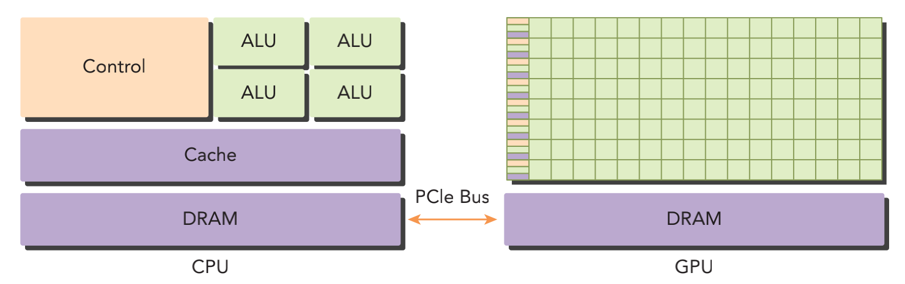
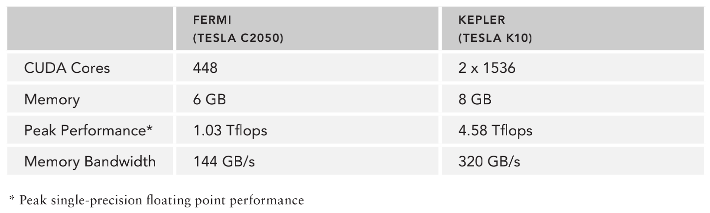
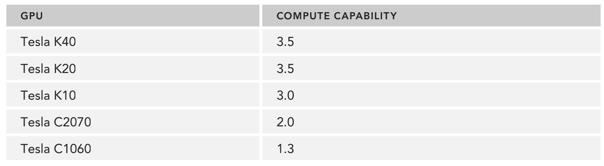
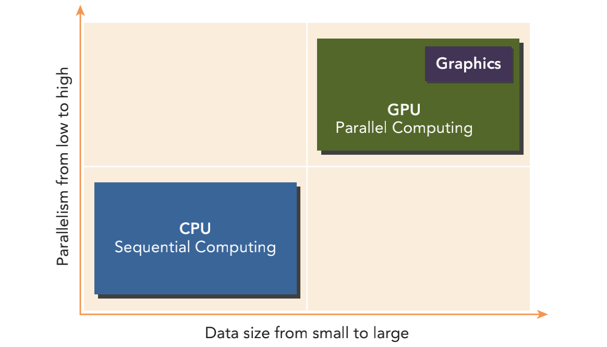
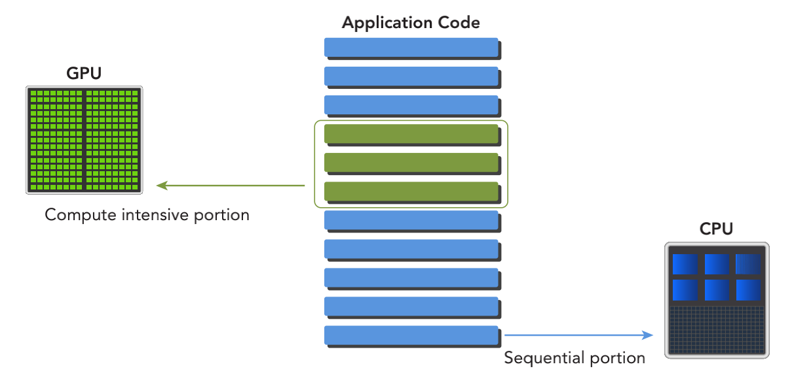
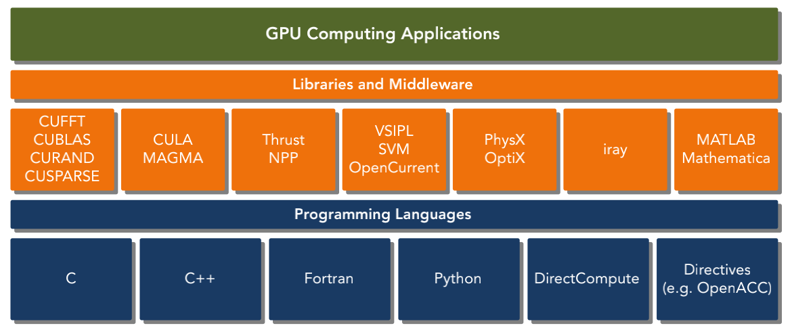
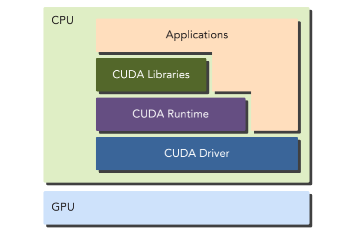
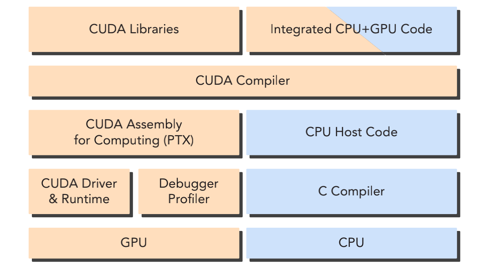
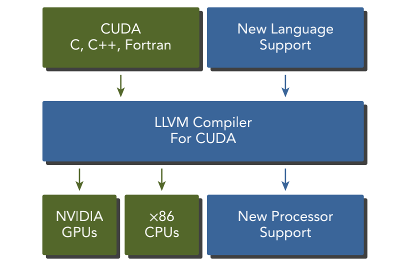
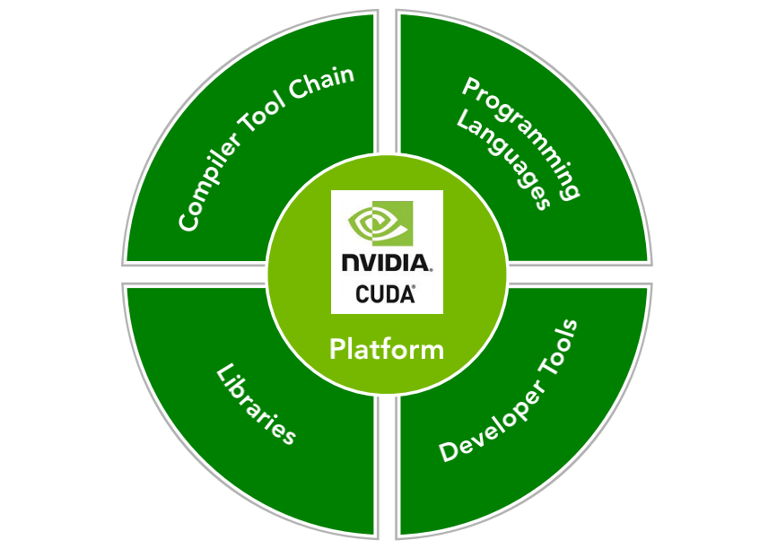

&emsp;
# Heterogeneous Computing
# 异构计算

GPU 最初是被设计用来专门处理并行图形计算问题的，随着时间的推移，GPU 已经成了更强大且更广义的处理器，在执行大规模并行计算中有着优越的性能和很高的效率。 

CPU 和 GPU 是两个独立的`处理器`，它们通过单个计算节点中的PCI-Express总线相连。 

在这种典型的架构中，GPU 指的是离散的设备从`同构系统`到`异构系统`的转变，是高性能计算史上的一个里程碑。
- `同构计算` 使用的是同一架构下的一个或多个处理器来执行一个应用
- `异构计算` 则使用一个处理器架构来执行一个应用，为任务选择适合它的架构，使其最终对性能有所改进。 

&emsp;
# 1 异构架构（Heterogeneous Architecture）

## 1.1 异构架构
一个典型的异构计算节点包括两个多核 CPU 插槽和两个或更多个的众核 GPU。GPU 不是一个独立运行的平台而是 CPU 的协处理器。因此，GPU必须通过PCIe总线与基于 CPU的主机相连来进行操作

    

&emsp;

这就是为什么CPU所在的位置被称作主机端（host）而 GPU 所在的位置被称作设备端（device）。

一个异构应用包括两个部分
- 主机代码 
- 设备代码 

主机代码在CPU上运行，设备代码在GPU上运行。异构平台上执行的应用通常由 CPU 初始化。在设备端加载计算密集型任务之前，CPU 代码负责管理设备端的环境、代码和数据。

当使用 CPU 上的一个与其物理上分离开的硬件组件来提高应用中的计算密集部分的执行速度时，这个组件就成为了一个硬件加速器。GPU 可以说是最为常见的硬件加速器。

&emsp;
## 1.2 NVIDIA 公司产品
以下产品应用了NVIDIA公司的GPU计算平台。
- Tegra 专为移动和嵌入式设备而设计的，如平板电脑和手机
- GeForce 面向图形用户
- Quadro 用于专业绘图设计
- Tesla 大规模的并行计算

>Fermi

Fermi 是 Tesla 系列产品中的一种。

NVIDIA于2010年 发布的Fermi架构是世界上第一款完整的 GPU 计算架构。Fermi GPU加速器的出现让许多领域的高性能计算有了新的发展，如地震资料处理、生化模拟、天气和气候建模、信号处理、计算金融、计算机辅助工程、计算流体力学和数据分析等。

>Kepler

Fermi 之后的新一代 GPU 计算架构 Kepler，于2012年秋季发布，其处理能力相比以往的GPU有很大提升，并且提供了新的方法来优化和提高 GPU 并行工作的执行，有望将高性能计算提升到新的高度。 Tegra K1 包含一个 Kepler GPU，并能满足 GPU 在嵌入式应用中的一切要求。 

>描述 GPU 容量的两个重要特征
- CUDA核心数量 
- 内存大小 

>GPU性能评价指标
- `峰值计算性能` 峰值计算性能是用来评估计算容量的一个指标，通常定义为每秒能处理的单精度或双精度浮点运算的数量。峰值性能通常用 GFlops（每秒十亿次浮点运算）或 TFlops（每秒万亿次浮点运算）来表示。
- `内存带宽` 内存带宽是从内存中读取或写入数据的比率。内存带宽通常用 GB/s 表示。
 

    
    <h4>Fermi 架构和 Kepler 架构的一些性能指标</h4>

&emsp;

>算力

NVIDIA使用一个术语“计算能力”（compute capability）来描述整个 Tesla 系列的 GPU 加速器的硬件版本。

    
    <h4>Tesla 产品的各个版本及其计算能力</h4>

&emsp;

具有相同主版本号的设备具有相同的核心架构
- 主版本 NO.3 是 Kepler 类架构
- 主版本 NO.2 是 Fermi 类架构
- 主版本 NO.1 是 Tesla 类架构

NVIDIA 发布的第一版 GPU 包含了与整个 Tesla GPU 加速器系列相同的名称“Tesla”

&emsp;
# 2 异构计算范例

GPU 计算并不是要取代 CPU 计算。CPU 计算适合处理控制密集型任务，GPU 计算适合处理包含数据并行的计算密集型任务。

CPU 针对动态工作负载进行了优化，这些动态工作负载是由短序列的计算操作和不可预测的控制流程标记的；而 GPU 在其他领域内的目的是：处理由计算任务主导的且带有简单控制流的工作负载。

    
    <h4></h4>

&emsp;

可以从两个方面来区分 CPU 和 GPU 应用的范围。 
- 并行级 
- 数据规模 

如果一个问题有较小的数据规模、复杂的控制逻辑和/或很少的并行性，那么最好选 择 CPU 处理该问题，因为它有处理复杂逻辑和指令级并行性的能力。相反，如果该问题包含较大规模的待处理数据并表现出大量的数据并行性，那么使用GPU是最好的选择。因为 GPU 中有大量可编程的核心，可以支持大规模多线程运算，而且相比CPU 有较大的峰值带宽。

CPU 和 GPU 的功能互补性导致了 CPU＋GPU 的异构并行计算架构的发展，这两种处理器的类型能使应用程序获得最佳的运行效果。因此，为获得最佳性能，你可以同时使用 CPU 和 GPU 来执行你的应用程序，在 CPU 上执行串行部分或任务并行部分，在GPU上执行数据密集型并行部分

    
    <h4></h4>

&emsp;

>CPU 线程与 GPU 线程

- CPU 上的线程通常是重量级的实体。操作系统必须交替线程使用启用或关闭 CPU 执行通道以提供多线程处理功能。上下文的切换缓慢且开销大。 
- GPU 上的线程是高度轻量级的。在一个典型的系统中会有成千上万的线程排队等待工作。如果 GPU 必须等待一组线程执行结束，那么它只要调用另一组线程执行其他任务即可。

CPU的核被设计用来尽可能减少一个或两个线程运行时间的延迟，而 GPU 的核是用来处理大量并发的、轻量级的线程，以最大限度地提高吞吐量。 

&emsp;
# 3 CUDA：一种异构计算平台

CUDA 是一种通用的并行计算平台和编程模型。

CUDA 平台可以通过 CUDA 加速库、编译器指令、应用编程接口以及行业标准程序语言的扩展（包括C、C++、Fortran、Python）来使用。

    
    <h4></h4>

>CUDA C

CUDA C 是标准 ANSI C 语言的一个扩展

CUDA 提供了两层 API 来管理 GPU 设备和组织线程
- CUDA驱动API 
- CUDA运行时API 

>CUDA驱动API 
- 驱动API是一种低级API，它相对来说较难编程，但是它对于在 GPU 设备使用上提供了更多的控制
>CUDA运行时API 
- 运行时API是一个高级API，它在驱动API的上层实现。每个运行时API函数 都被分解为更多传给驱动API的基本运算

>运行时 API 与驱动 API 

- 运行时 API 和驱动 API 之间没有明显的性能差异。在设备端，内核是如何使用内存以及你是如何组织线程的，对性能有更显著的影响。这两种API是相互排斥的，你必须使用两者之一，从两者中混合函数调用是不可能 的。我们使用运行时API。

    
    <h4></h4>

一个CUDA程序包含了以下两个部分的混合

- 在CPU上运行的主机代码
- 在GPU上运行的设备代码 

NVIDIA 的 CUDA nvcc 编译器在编译过程中将设备代码从主机代码中分离出来。
- 主机代码是标准的 C 代码，使用C编译器进行编译
- 设备代码，也就是核函数，是用扩展的带有标记数据并行函数关键字的 CUDA C 语言编写的。设备代码通过 nvcc 进行编译
- 在链接阶段，在内核程序调用和显示 GPU 设备操作中添加 CUDA 运行时库

    
    <h4></h4>

&emsp;

CUDA nvcc 编译器是以广泛使用 LLVM 开源编译系统为基础的。在 GPU 加速器的支持下，通过使用 CUDA 编译器 SDK，你可以创建或扩展编程语言

    
    <h4></h4>

&emsp;

    
    <h4>CUDA 平台</h4>

&emsp;

