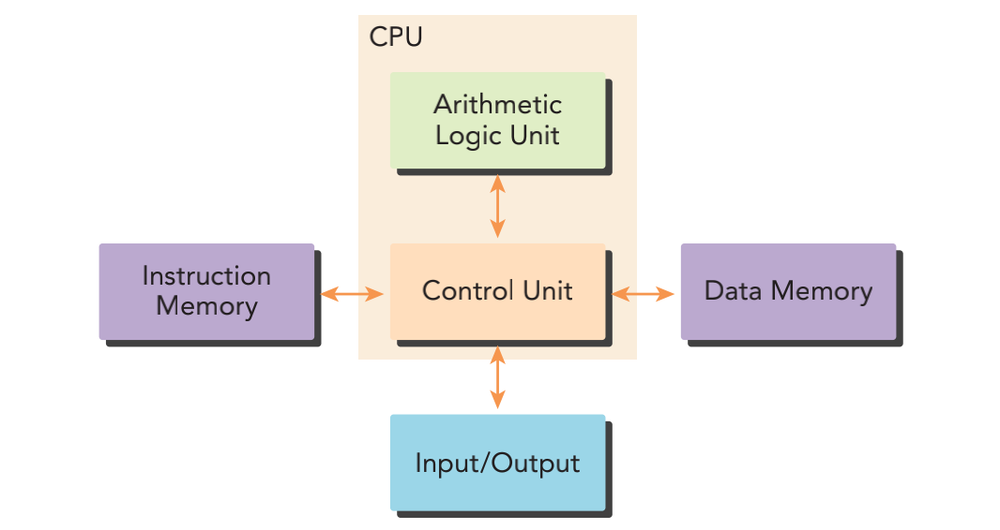
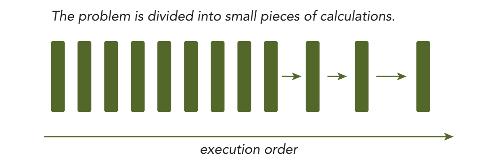
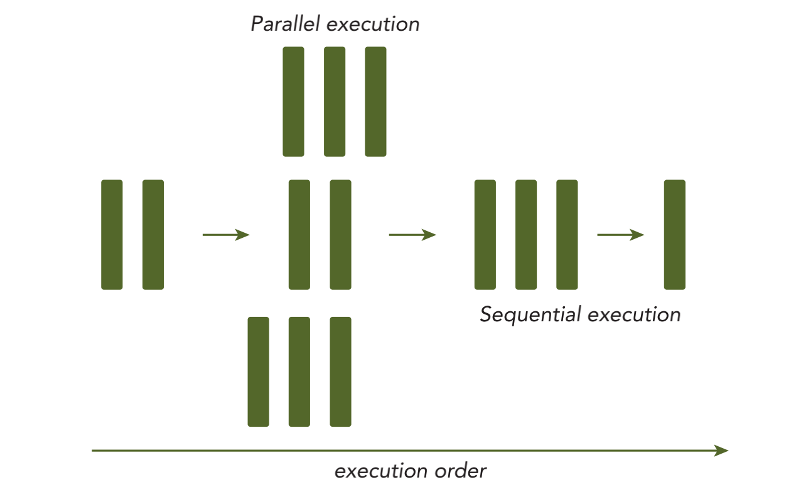
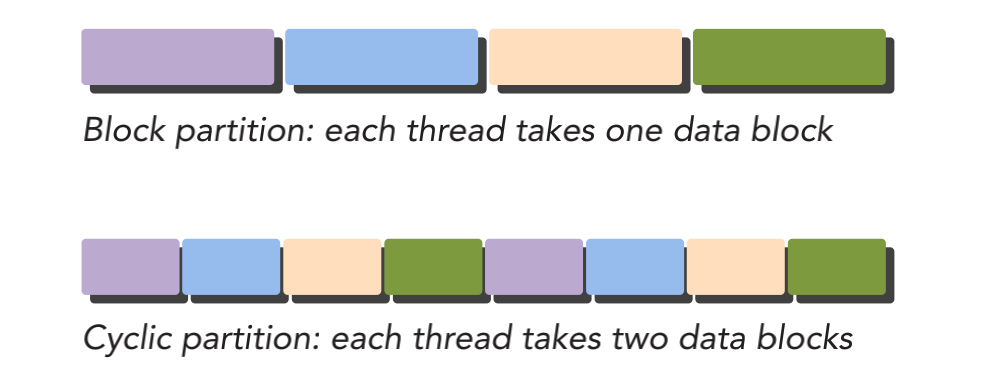
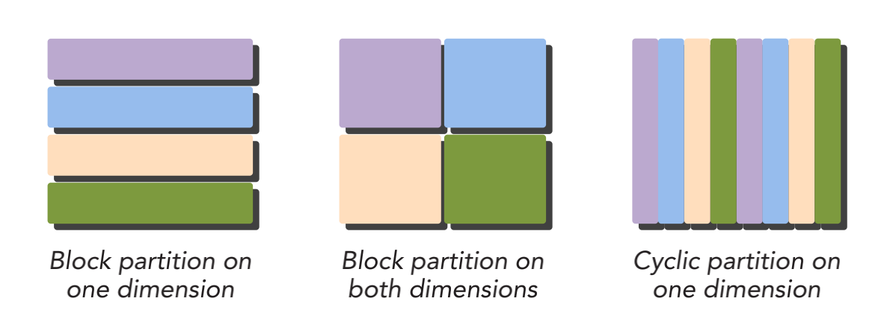
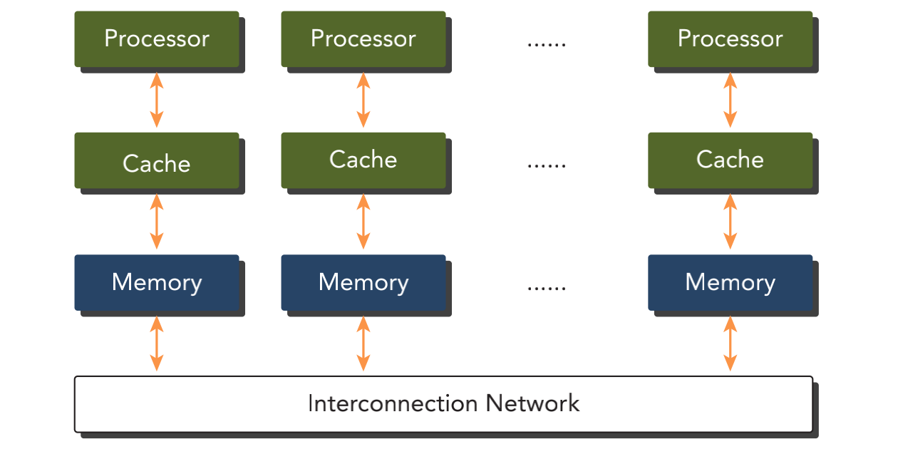
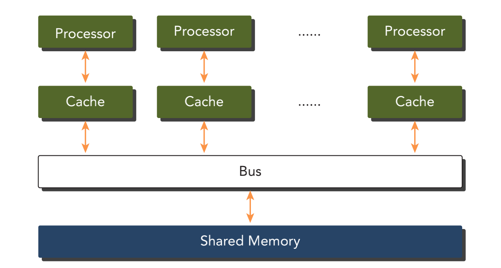

&emsp;
# Parallel Computing
# 并行计算

计算机可以同时进行许多运算，一个大的问题往往可以被划分为很多可以同时解决的小问题。 

假设你有许多计算资源，并行计算可以被定义为同时使用许多计算资源（核心或计算机）来执行并发计算，一个大的问题可以被分解成多个小问题，然后在不同的计算资源上并行处理这些小问题。

并行计算涉及两个不同的计算技术领域
- 计算机架构（硬件方面）
- 并行程序设计（软件方面） 

大多数现代处理器都应用了`哈佛体系结构（Harvard architecture）`，它主要由3个部分组成
- 内存（指令内存和数据内存） 
- 中央处理单元（控制单元和算术逻辑单元） 
- 输入/输出接口 

    
    <h4>哈佛体系结构（Harvard architecture）</h4>

&emsp;

高性能计算的关键部分是`中央处理单元（CPU）`。

在早期的计算机中，一个芯片上只有一个 CPU，这种结构被称为单核处理器。现在，芯片设计将多个核心集成到一个单一的处理器上，以在体系结构级别支持并行性，这种形式通常被称为`多核处理器`。

并行程序设计可以看作是将`一个问题的计算`分配给`可用的核心`以实现并行的过程。 在多核计算机上执行算法时，了解基本的计算机架构的特点就非常重要。

&emsp;
# 1 串行编程和并行编程（Sequential and Parallel Programming）

当用计算机程序解决一个问题时，我们会很自然地把这个问题划分成许多的运算块， 每一个运算块执行一个指定的任务，这样的程序叫作`串行程序`。 

    
    <h4>串行程序</h4>

&emsp;

有两种方法可以区分两个计算单元之间的关系：有些是有执行次序的，所以必须串行执行；其他的没有执行次序的约束，则可以并发执行。所有包含并发执行任务的程序都是`并行程序`。一个并行程序中可能会有一些串行部分

    
    <h4>并行程序</h4>

&emsp;

一个程序应包含两个基本的组成部分：
- 指令
- 数据

当一个计算问题被划分成许多小的计算单元后，每个计算单元都是一个任务。在一个任务中，单独的指令负责处理输入和调用一个函数并产生输出。

&emsp;
# 2 并行性（Parallelism）

在应用程序中有两种基本的并行类型
- 任务并行 
- 数据并行 

>任务并行

- 当许多任务或函数可以独立地、大规模地并行执行时，这就是任务并行。任务并行的重点在于利用多核系统对任务进行分配。 

>数据并行

- 当可以同时处理许多数据时，这就是数据并行。数据并行的重点在于利用多核系统对数据进行分配。 

CUDA 编程非常适合解决`数据并行`计算的问题。

数据并行程序设计的第一步是把数据依据线程进行划分，以使每个线程处理一部分数据。通常来说，有两种方法可以对数据进行划分：
- 块划分（block partitioning）
- 周期划分 （cyclic partitioning）

>块划分

- 在块划分中，一组连续的数据被分到一个块内。每个数据块以任意次序被安排给一个线程，线程通常在同一时间只处理一个数据块。

>周期划分

- 在周期划分中，更少 的数据被分到一个块内。相邻的线程处理相邻的数据块，每个线程可以处理多个数据块。 

>Ps.

- 程序性能通常对块的大小比较敏感。块划分与周期划分中划分方式的选择与计算机架构有密切关系。

    
    <h4>块、周期划分例子1</h4>

&emsp;

    
    <h4>块、周期划分例子2</h4>

&emsp;

&emsp;
# 3 计算机架构（Computer Architecture）

## 3.1 计算机架构弗林分类法
弗林分类法（Flynn’s Taxonomy）根据指令和数据进入 CPU 的方式，将计算机架构分为4种不同的类型
- 单指令单数据（SISD）
- 单指令多数据（SIMD） 
- 多指令单数据（MISD）
- 多指令多数据（MIMD） 

>SISD

- SISD 指的是传统计算机：一种串行架构。在这种计算机上只有一个核心。在任何时间点上只有一个指令流在处理一个数据流。 

>SIMD
- SIMD 是一种并行架构类型。在这种计算机上有多个核心。在任何时间点上所有的核心只有一个指令流处理不同的数据流。向量机是一种典型的 SIMD 类型的计算机，现在大多数计算机都采用了 SIMD 架构。SIMD 最大的优势或许就是，在 CPU 上编写代码时，程序员可以继续按串行逻辑思考但对并行数据操作实现并行加速，而其他细节则由编译器来负责。

>MISD

- MISD 类架构比较少见，在这种架构中，每个核心通过使用多个指令流处理同一个数据流。
>MIMD

- MIMD 是一种并行架构，在这种架构中，多个核心使用多个指令流来异步处理多个数据流，从而实现空间上的并行性。许多 MIMD 架构还包括 SIMD 执行的子组件。 

&emsp;
## 3.2 计算机架构内存组织分类
计算机架构也能根据内存组织方式进行进一步分成两种类型
- 分布式内存的多节点系统 
- 共享内存的多处理器系统 

>分布式内存的多节点系统 
- 在多节点系统中，大型计算引擎是由许多网络连接的处理器构成的。每个处理器有自己的本地内存，而且处理器之间可以通过网络进行通信，这种系统常被称作`集群`。

    
    <h4>分布式内存的多节点系统 </h4>

&emsp;

>共享内存的多处理器系统 

- 多处理器架构的大小通常是从双处理器到几十个或几百个处理器之间。这些处理器要么是与同一个物理内存相关联，要么共用一个低延迟的链路（如 PCI- Express 或 PCIe）。尽管共享内存意味着共享地址空间，但并不意味着它就是一个独立的物理内存。这样的多处理器不仅包括由多个核心组成的单片机系统，即所谓的多核系统， 而且还包括由多个芯片组成的计算机系统，其中每一个芯片都可能是多核的。

    
    <h4>共享内存的多处理器系统 </h4>

&emsp;

&emsp;
## 3.3 众核架构

“众核”（many-core）通常是指有很多核心（几十或几百个）的多核架构。近年来，计算机架构正在从多核转向众核。

`GPU` 代表了一种众核架构，几乎包括了前文描述的所有并行结构：
多线程、 MIMD（多指令多数据）、SIMD（单指令多数据），以及指令级并行。NVIDIA 公司称这种架构为 SIMT（单指令多线程）。 

>GPU 核心和 CPU 核心 
- 尽管可以使用多核和众核来区分 CPU 和 GPU 的架构，但这两种核心是完全不同的
- CPU 核心比较重，用来处理非常复杂的控制逻辑，以优化串行程序执行
- GPU 核心较轻，用于优化具有简单控制逻辑的数据并行任务，注重并行程序的吞吐量

&emsp;
## 3.4 计算机架构的延迟、带宽、吞吐量

>延迟
- 延迟是一个操作从开始到完成所需要的时间，常用微秒来表示。延迟用来衡量完成一次操作的时间
>带宽
- 带宽是单位时间内可 处理的数据量，通常表示为 MB/s 或 GB/s。

>吞吐量
- 吞吐量是单位时间内成功处理的运算数量，通常表示为gflops（即每秒十亿次的浮点运算数量），特别是在重点使用浮点计算的科学计算领域经常用到。吞吐量用来衡量在给定的单位时间内处理的操作量

