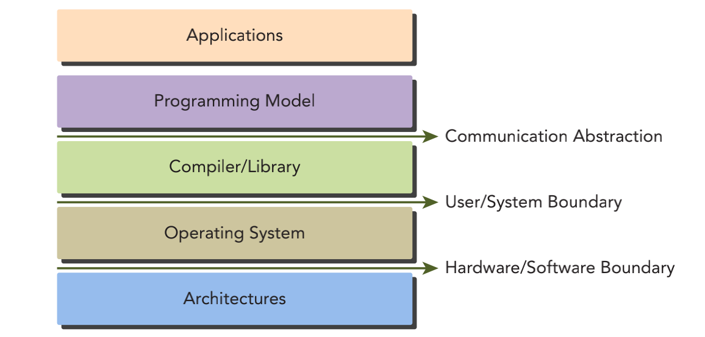
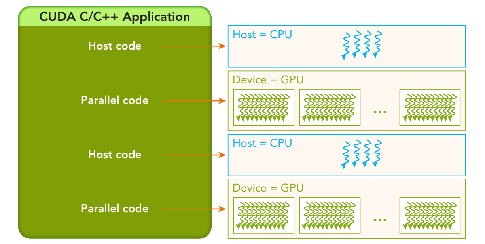

&emsp;
# CUDA Programming Structure
# CUDA 编程结构

CUDA 编程模型提供了一个计算机架构抽象作为应用程序和其可用硬件之间的桥梁。通信抽象（Communication Abstraction）是程序与编程模型实现之间的分界线，它通过专业的硬件原语和操作系统的编译器或库来实现。

    
    <h4>程序和编程模型实现之间的抽象结构</h4>

&emsp;

除了与其他并行编程模型共有的抽象外，CUDA 编程模型还利用 GPU 架构的计算能力提供了以下几个特有功能
- 一种通过层次结构在 GPU 中组织线程的方法 
- 一种通过层次结构在 GPU 中访问内存的方法

以程序员的角度可以从以下几个不同的层面来看待并行计算
- 领域层 
- 逻辑层 
- 硬件层 

在 C 语言并行编程中，需要使用 pthreads 或 OpenMP 技术来显式地管理线程。CUDA 提出了一个线程层次结构抽象的概念，以允许控制线程行为。

&emsp;
# 1 CUDA 编程结构

在一个异构环境中包含多个 CPU 和 GPU，每个 GPU 和 CPU 的内存都由一条PCI-Express总线分隔开。因此，需要注意区分以下内容
- 主机（host）：CPU及其内存（主机内存） 
- 设备（device）：GPU及其内存（设备内存） 

约定，主机内存中的变量名以 `h_` 为前缀，设备内存中的变量名以 `d_` 为前缀

内核（kernel）是 CUDA 编程模型的一个重要组成部分，其代码在 GPU 上运行。

多数情况下，主机可以独立地对设备进行操作。内核一旦被启动，管理权立刻返回给主机，释放 CPU 来执行由设备上运行的并行代码实现的额外的任务。

CUDA 编程模型主要是异步的，因此在 GPU 上进行的运算可以与主机-设备通信重叠。一个典型的 CUDA 程序包括由并行代码互补的串行代码。

    
    <h4>程序和编程模型实现之间的抽象结构</h4>

- 串行代码（及任务并行代码）在主机 CPU 上执行，主机代码按照 ANSI C 标准进行编写
- 并行代码在 GPU 上执行，设备代码使用 CUDA C 进行编写
- 可以将所有的代码统一放在一个源文件中，也可以使用多个源文件来构建应用程序和库。NVIDIA 的 C 编译器（nvcc）为主机和设备生成可执行代码。 

