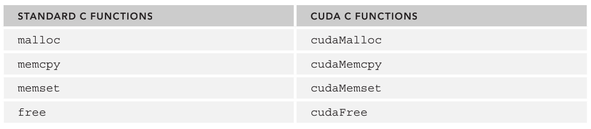
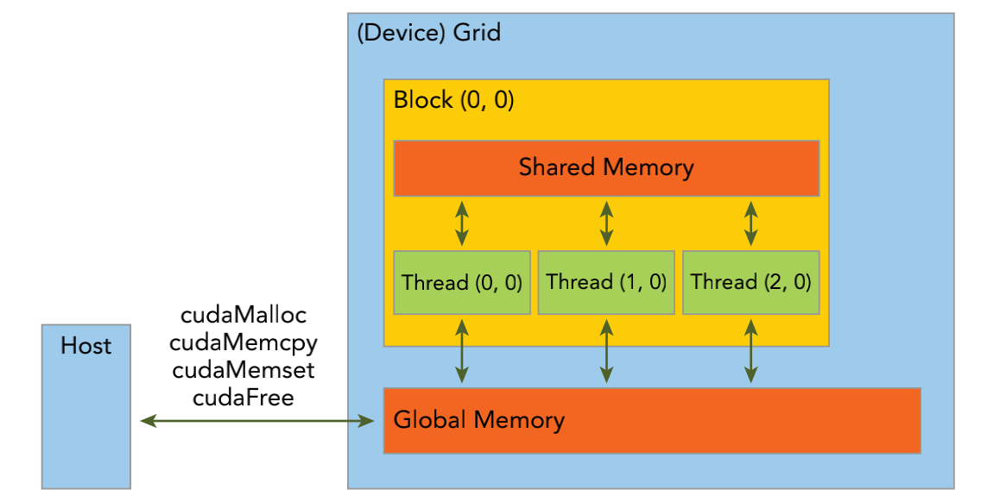
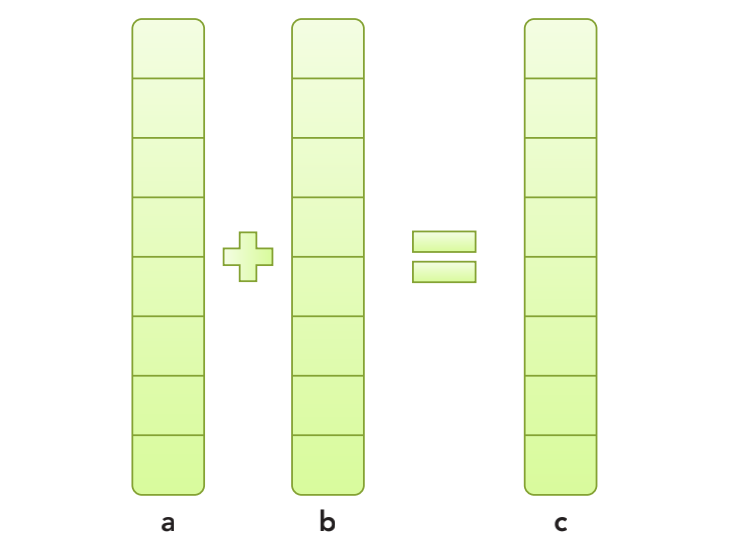

&emsp;
# Managing Memory
# 内存管理

# 1 常用函数
CUDA 编程模型假设系统是由一个 `主机（host）`和一个 `设备（device）`组成的，而且各自拥有独立的内存。

核函数是在设备上运行的。为使你拥有充分的控制权并使系统达到最佳性能，CUDA 运行时负责分配与释放设备内存，并且在主机内存和设备内存之间传输数据。

&emsp;
>cudaMalloc 
- 函数用于执行 GPU 内存分配的是，其函数原型为： 
```c++
cudaError_t cudaMalloc ( void** devPtr, size_t size )
```
- 主机和设备内存函数该函数负责向设备分配一定字节的线性内存，并以 devPtr 的形式返回指向所分配内存的指针。

&emsp;
>cudaMemcpy 
- 函数负责主机和设备之间的数据传输，其函数原型为： 
```c++
cudaError_t cudaMemcpy ( void* dst, const void* src, size_t count, cudaMemcpyKind kind )
```
- 此函数从src指向的源存储区复制一定数量的字节到dst指向的目标存储区。复制方向 由kind指定，其中的kind有以下几种
    - cudaMemcpyHostToHost
    - cudaMemcpyHostToDevice
    - cudaMemcpyDeviceToHost
    - cudaMemcpyDeviceToDevice

这个函数以`同步方式`执行，因为在 cudaMemcpy 函数返回以及传输操作完成之前，主机应用程序是阻塞的。除了内核启动之外的 CUDA 调用都会返回一个错误的枚举类型 cuda Error_t。

如果GPU内存分配成功，函数返回： 
```c++
cudaSuccess
```
否则返回： 
```c++
cudaErrorMemoryAllocation
```
可以使用以下 CUDA 运行时函数将错误代码转化为可读的错误消息： 
```c++
char* cudaGetErrorString(cudaError_t error)
```
cudaGetErrorString 函数和 C 语言中的 strerror 函数类似。

<div align=center>
    
    <h4>标准的 C 函数和对应的 CUDA C 函数</h4>
</div>

&emsp;

# 2 内存模型

CUDA 编程模型从 GPU 架构中抽象出一个内存层次结构，它主要包含两部分：
- 全局内存
- 共享内存

全局类似于 CPU 的系统内存，而共享内存类似于 CPU 的缓存。然而 GPU 的共享内存可以由 CUDA C 的内核直接控制。

<div align=center>
    
    <h4>简化的 GPU 内存结构</h4>
</div>

&emsp;


# 3 示例
我们通过一个简单的两个数组相加的例子来学习如何在主机和设备之间进行数据传输，以及如何使用 CUDA C 编程。

数组 a 的第一个元素与数组 b 的第一个元素相加，得到的结果作为数组 c 的第一个元素，重复这个过程直到数组中的所有元素都进行了一次运算。 

<div align=center>
    
    <h4>简化的 GPU 内存结构</h4>
</div>

&emsp;

## 3.1 C 程序的加和
>sumArrayOnhost.c
```c++
#include <stdlib.h>
#include <string.h>
#include <time.h>
void sumArraysOnHost(float *A, float *B, float *C, const int N) {
    for (int idx=0; idx<N; idx++) {
        C[idx] = A[idx] + B[idx];
    }
}

void initialData(float *ip,int size) {
    // generate different seed for random number
    time_t t;
    srand((unsigned int) time(&t));
    for (int i=0; i<size; i++) {
        ip[i] = (float)( rand() & 0xFF )/10.0f;
    }
}

int main(int argc, char **argv) {
    int nElem = 1024;
    size_t nBytes = nElem * sizeof(float);
    float *h_A, *h_B, *h_C;
    h_A = (float *)malloc(nBytes);
    h_B = (float *)malloc(nBytes);
    h_C = (float *)malloc(nBytes);
    initialData(h_A, nElem);
    initialData(h_B, nElem);
    sumArraysOnHost(h_A, h_B, h_C, nElem);
    free(h_A);
    free(h_B);
    free(h_C);
    return(0);
}
```

&emsp;
## 3.2 GPU的加和
在 GPU 上修改代码来进行数组加法运算

>cudaMalloc
- 在GPU上申请内存
```c++
float *d_A, *d_B, *d_C;
cudaMalloc((float**)&d_A, nBytes);
cudaMalloc((float**)&d_B, nBytes);
cudaMalloc((float**)&d_C, nBytes);
```

>cudaMemcpy
- 把数据从主机内存拷贝到GPU的全局内存中，参数cudaMemcpyHostToDevice指定数据拷贝方向
```c++
cudaMemcpy(d_A, h_A, nBytes, cudaMemcpyHostToDevice);
cudaMemcpy(d_B, h_B, nBytes, cudaMemcpyHostToDevice);
```

当数据被转移到GPU的全局内存后，主机端调用核函数在 GPU 上进行数组求和。一旦内核被调用，控制权立刻被传回主机，这样的话，当核函数在GPU上运行时，主机可以执行其他函数。因此，内核与主机是异步的。 

当内核在GPU上完成了对所有数组元素的处理后，其结果将以数组 d_C 的形式存储在 GPU 的`全局内存`中

>cudaMemcpy
- 把结果从GPU复制回到主机的数组gpuRef中

cudaMemcpy的调用会导致主机运行阻塞。cudaMemcpyDeviceToHost的作用就是将存储在 GPU 上的数组 d_c 中的结果复制到 gpuRef 中
```c++
cudaMemcpy(gpuRef, d_C, nBytes, cudaMemcpyDeviceToHost);
```

>cudaFree
- 最后，调用cudaFree释放GPU的内存

```c++
cudaFree(d_A);
cudaFree(d_B);
cudaFree(d_C);
```

