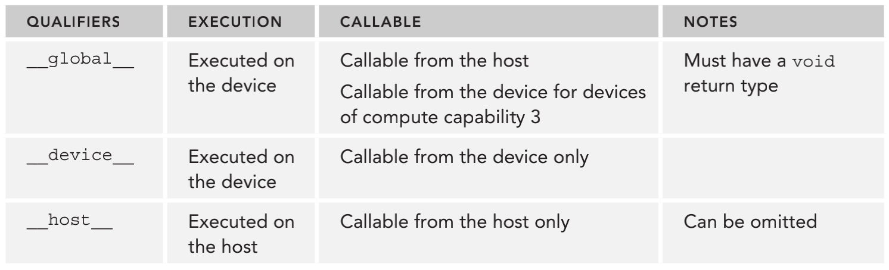

&emsp;
# Writing Your Kernel
# 编写核函数

&emsp;
# 1 核函数的定义
核函数是在`设备端`执行的代码。在核函数中，需要为一个线程规定要进行的计算以及要进行的数据访问。

当核函数被调用时，许多不同的 CUDA 线程并行执行`同一个计算任务`。

以下是用`__global__`声明定义核函数，核函数必须有一个void返回类型： 
```c++
__global__ void kernel_name(argument list);
```

&emsp;
# 2 函数类型限定符

函数类型限定符指定一个函数在主机 上执行还是在设备上执行，以及可被主机调用还是被设备调用。

`__device__`和`__host__`限定符可以一齐使用，这样函数可以同时在主机和设备端进行编译。

<div align=center>
    
    <h4>CUDA C 程序的函数类型限定符<h>
</div>

>CUDA核函数的限制，以下限制适用于所有核函数
- 只能访问设备内存 
- 必须具有void返回类型 
- 不支持可变数量的参数
- 不支持静态变量 
- 显示异步行为 

&emsp;
# 3 示例
考虑一个简单的例子：将两个大小为 N 的向量 A 和 B 相加，主机端的向量加法的 C 代码如下：
```c++
void sumArraysOnHost(float *A, float *B, float *C, const int N) {
    for (int i = 0; i < N; i++)
        C[i] = A[i] + B[i];
}
```

对应的核函数： 
```c++
__global__ void sumArraysOnGPU(float *A, float *B, float *C) {
    int i = threadIdx.x;
    C[i] = A[i] + B[i];
}
```


C函数和核函数之间有什么不同？你可能已经注意到循环体消失了，内置的线程坐标 变量替换了数组索引，由于 N 是被隐式定义用来启动 N 个线程的，所以 N 没有什么参考价值。

假设有一个长度为32个元素的向量，你可以按以下方法用32个线程来调用核函数：
```c++
sumArraysOnGPU<<<1,32>>>(float *A, float *B, float *C);
```


