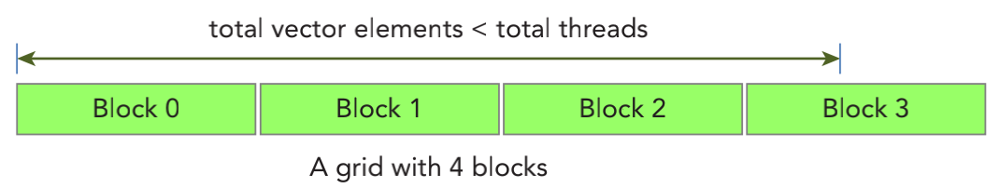

&emsp;
# Timing With CPU Timer
# 用 CPU 计时器计时


可以使用 gettimeofday 系统调用来创建一个 CPU 计时器，以获取系统的时钟时间，它将返回自1970年1月1日零点以来，到现在的秒数。程序中需要添加sys/time.h头文件，如代码清单2-5所示。 

```c++
double cpuSecond() {
    struct timeval tp;
    gettimeofday(&tp,NULL);
    return ((double)tp.tv_sec + (double)tp.tv_usec*1.e-6);
}
```

你可以用 cpuSecond 函数来测试你的核函数： 
```c++
double iStart = cpuSecond();
kernel_name<<<grid, block>>>(argument list);
cudaDeviceSynchronize();
double iElaps = cpuSecond() - iStart;
```


由于核函数调用与主机端程序是异步的，你需要用cudaDeviceSynchronize函数来等待 所有的 GPU 线程运行结束。变量iElaps表示程序运行的时间，就像你用手表记录的核函数 的执行时间（用秒计算）。 


现在，通过设置数据集大小来对一个有16M个元素的大向量进行测试： 

```c++
int nElem = 1<<24;
```

由于 GPU 的可扩展性，你需要借助块和线程的索引来计算一个按行优先的数组索引 i，并对核函数进行修改，添加限定条件（i＜N）来检验索引值是否越界，如下所示：

```c++
__global__ void sumArraysOnGPU(float *A, float *B, float *C, const int N) {
 int i = blockIdx.x * blockDim.x + threadIdx.x;
 if (i < N) C[i] = A[i] + B[i];
}
```

有了这些更改，可以使用不同的执行配置来衡量核函数。为了解决创建的线程总数大于向量元素总数的情况，你需要限制内核不能非法访问全局内存

<div align=center>
    
</div>


```c++
#include "common.h"
#include <cuda_runtime.h>
#include <stdio.h>


void checkResult(float *hostRef, float *gpuRef, const int N)
{
    double epsilon = 1.0E-8;
    bool match = 1;

    for (int i = 0; i < N; i++)
    {
        if (abs(hostRef[i] - gpuRef[i]) > epsilon)
        {
            match = 0;
            printf("Arrays do not match!\n");
            printf("host %5.2f gpu %5.2f at current %d\n", hostRef[i],
                   gpuRef[i], i);
            break;
        }
    }

    if (match) printf("Arrays match.\n\n");

    return;
}

void initialData(float *ip, int size)
{
    // generate different seed for random number
    time_t t;
    srand((unsigned) time(&t));

    for (int i = 0; i < size; i++)
    {
        ip[i] = (float)( rand() & 0xFF ) / 10.0f;
    }

    return;
}

void sumArraysOnHost(float *A, float *B, float *C, const int N)
{
    for (int idx = 0; idx < N; idx++)
    {
        C[idx] = A[idx] + B[idx];
    }
}
__global__ void sumArraysOnGPU(float *A, float *B, float *C, const int N)
{
    int i = blockIdx.x * blockDim.x + threadIdx.x;

    if (i < N) C[i] = A[i] + B[i];
}

int main(int argc, char **argv)
{
    printf("%s Starting...\n", argv[0]);

    // set up device
    int dev = 0;
    cudaDeviceProp deviceProp;
    CHECK(cudaGetDeviceProperties(&deviceProp, dev));
    printf("Using Device %d: %s\n", dev, deviceProp.name);
    CHECK(cudaSetDevice(dev));

    // set up data size of vectors
    int nElem = 1 << 24;
    printf("Vector size %d\n", nElem);

    // malloc host memory
    size_t nBytes = nElem * sizeof(float);

    float *h_A, *h_B, *hostRef, *gpuRef;
    h_A     = (float *)malloc(nBytes);
    h_B     = (float *)malloc(nBytes);
    hostRef = (float *)malloc(nBytes);
    gpuRef  = (float *)malloc(nBytes);

    double iStart, iElaps;

    // initialize data at host side
    iStart = seconds();
    initialData(h_A, nElem);
    initialData(h_B, nElem);
    iElaps = seconds() - iStart;
    printf("initialData Time elapsed %f sec\n", iElaps);
    memset(hostRef, 0, nBytes);
    memset(gpuRef,  0, nBytes);

    // add vector at host side for result checks
    iStart = seconds();
    sumArraysOnHost(h_A, h_B, hostRef, nElem);
    iElaps = seconds() - iStart;
    printf("sumArraysOnHost Time elapsed %f sec\n", iElaps);

    // malloc device global memory
    float *d_A, *d_B, *d_C;
    CHECK(cudaMalloc((float**)&d_A, nBytes));
    CHECK(cudaMalloc((float**)&d_B, nBytes));
    CHECK(cudaMalloc((float**)&d_C, nBytes));

    // transfer data from host to device
    CHECK(cudaMemcpy(d_A, h_A, nBytes, cudaMemcpyHostToDevice));
    CHECK(cudaMemcpy(d_B, h_B, nBytes, cudaMemcpyHostToDevice));
    CHECK(cudaMemcpy(d_C, gpuRef, nBytes, cudaMemcpyHostToDevice));

    // invoke kernel at host side
    int iLen = 512;
    dim3 block (iLen);
    dim3 grid  ((nElem + block.x - 1) / block.x);

    iStart = seconds();
    sumArraysOnGPU<<<grid, block>>>(d_A, d_B, d_C, nElem);
    CHECK(cudaDeviceSynchronize());
    iElaps = seconds() - iStart;
    printf("sumArraysOnGPU <<<  %d, %d  >>>  Time elapsed %f sec\n", grid.x,
           block.x, iElaps);

    // check kernel error
    CHECK(cudaGetLastError()) ;

    // copy kernel result back to host side
    CHECK(cudaMemcpy(gpuRef, d_C, nBytes, cudaMemcpyDeviceToHost));

    // check device results
    checkResult(hostRef, gpuRef, nElem);

    // free device global memory
    CHECK(cudaFree(d_A));
    CHECK(cudaFree(d_B));
    CHECK(cudaFree(d_C));

    // free host memory
    free(h_A);
    free(h_B);
    free(hostRef);
    free(gpuRef);

    return(0);
}
```


