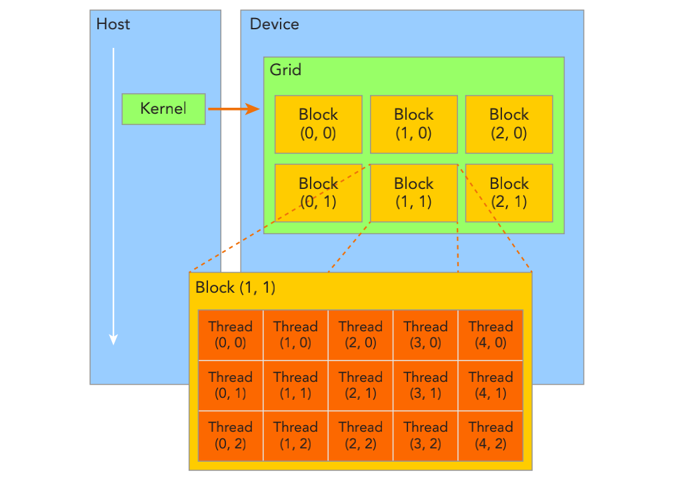

&emsp;
# Organizing Threads
# 线程管理


<div align=center>
    
    <h4>CUDA 的线程层次抽象概念<h>
</div>

&emsp;


# 1 索引
由一个内核启动所产生的所有线程统称为一个网格（grid）。同一网格中的所有线程共享相同的全局内存空间（global memory）。一个网格由多个线程块（block）构成，一个线程块包含一组线程（thread），同一线程块内的线程协作可以通过以下方式来实现
- 同步
- 共享内存 

不同块内的线程不能协作。 线程依靠以下两个坐标变量来区分彼此。 
- blockIdx（block在grid内的索引） 
- threadIdx（thread在block内的索引） 

这些变量是核函数中需要预初始化的内置变量。当执行一个核函数时，CUDA 运行时为每个线程分配坐标变量 blockIdx 和 threadIdx。基于这些坐标，你可以将部分数据分配给不同的线程。 该坐标变量是基于 `uint3` 定义的CUDA内置的向量类型，是一个包含 `3 个无符号整数`的结构，可以通过x、y、z三个字段来指定
- blockIdx（block在grid内的索引） 
    - blockIdx.x
    - blockIdx.y
    - blockIdx.z

- threadIdx（thread在block内的索引） 
    - threadIdx.x
    - threadIdx.y
    - threadIdx.z

&emsp;
# 2 维度

## 2.1 gridDim 和 blockDim
CUDA 可以组织三维的网格（grids）和块（blocks）。网格和块的维度由下列两个内置变量指定
- blockDim（block 的维度，用每个 block 中的 thread 数量来表示） 
- gridDim（grid 的维度，用每个 grid 中的 block 数来表示） 

它们是 `dim3` 类型的变量，是基于 `uint3` 定义的整数型向量，用来表示维度。当定义一个 dim3 类型的变量时，所有未指定的元素都被初始化为1。dim3类型变量中的每个组件可以通过它的x、y、z字段获得。如下所示。
- blockDim（block 的维度，用每个 block 中的 thread 数量来表示） 
    - blockDim.x
    - blockDim.y
    - blockDim.z

- gridDim（grid 的维度，用每个 grid 中的 block 数来表示） 
    - gridDim.x
    - gridDim.y
    - gridDim.z


## 2.2 手动定义与预定义

通常，一个`线程格（grid）`会被组织成二维数组形式，一个`线程块（block）`会被组织成三维数组形式。 

线程格（grid）和线程块（block）均使用 3 个 `dim3类型` 的无符号整型字段，而未使用的字段将被初始化为 `1` 且忽略不计。 

在CUDA程序中有两组不同的网格和块变量：
- 手动定义的 dim3 数据类型
- 预定义的 uint3 数据类型

在主机端，作为内核调用的一部分，你可以使用 `dim3 数据类型`定义一个网格（grid）和块（block）的维度。

当执行核函数时，CUDA 运行时会生成相应的内置预初始化的网格、块和线程变量，它们在核函数内均可被访问到且为 `unit3 类型`。

手动定义的dim3类型的网格和块变量`仅在主机端`可见，而 `unit3 类型`的内置预初始化的网格和块变量`仅在设备端`可见。 

&emsp;
>checkDimension.cu
```c++
#include <cuda_runtime.h>
#include <stdio.h>

__global__ void checkIndex(void)
{
    int threadID = blockDim.x*blockIdx.x + threadIdx.x;
    printf("----------threadID = %d----------\n", threadID);
    printf("blockIdx: (%d, %d, %d)"
           "threadIdx: (%d, %d, %d)\n", 
           blockIdx.z, blockIdx.y, blockIdx.x,
           threadIdx.z, threadIdx.y, threadIdx.x);
}

int main(int argc, char **argv)
{
    // define total data element
    int nElem = 6;

    // define grid and block structure
    dim3 block(3);
    dim3 grid((nElem + block.x - 1) / block.x); // 2

    // check grid and block dimension from host side
    printf("gridDim = (%d, %d, %d)\n", grid.z, grid.y, grid.x);
    printf("blockDim = (%d, %d, %d)\n", block.z, block.y, block.x);

    // check grid and block dimension from device side
    // (2, 3)
    checkIndex<<<grid, block>>>();

    // reset device before you leave
    cudaDeviceReset();

    return(0);
}
```

&emsp;
# 3 数据的分配

根据索引和维度，对于一个给定的数据大小，确定网格和块尺寸的一般步骤为： 
- 确定块的大小 
- 在已知数据大小和块大小的基础上计算网格维度

要确定块尺寸，通常需要考虑：
- 内核的性能特性
- GPU资源的限制


