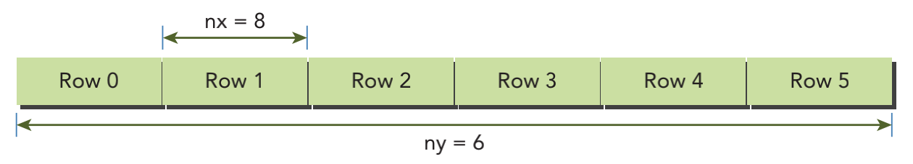
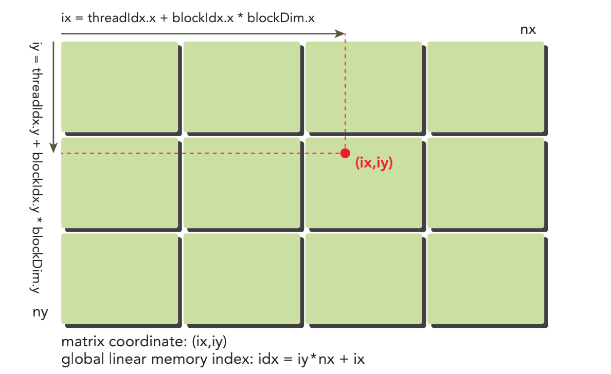
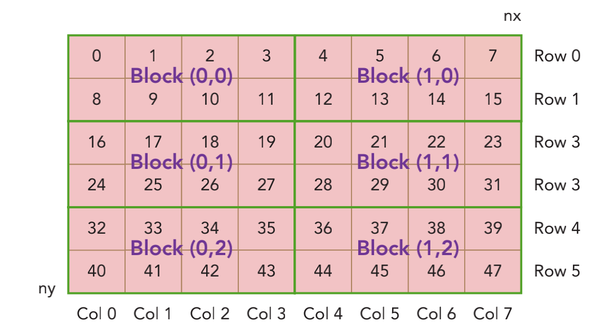

&emsp;
# Indexing Matrices With Blocks And Threads


通常情况下，一个矩阵用行优先的方法在全局内存中进行线性存储。图2-9所示的是 一个8×6矩阵的小例子。 

在一个矩阵加法核函数中，一个线程通常被分配一个数据元素来处理。首先要完成的任务是使用块（block）和线程（thread）索引从全局内存中访问指定的数据。通常情况下，对一个二维示例来说，需要管理3种索引： 
- 线程和块索引 
- 矩阵中给定点的坐标
- 全局线性内存中的偏移量 

<div align=center>
    
</div>

&emsp;


对于一个给定的线程，首先可以通过把线程索引（threaIdx）和块索引（blockIdx）映射到矩阵坐标上来获取线程块和线程索引的全局内存偏移量，然后将这些矩阵坐标映射到全局内存的存储单元中。 

第一步，可以用以下公式把线程和块索引映射到矩阵坐标上： 
```c++
ix = threadIdx.x + blockIdx.x * blockDim.x
iy = threadIdx.y + blockIdx.y * blockDim.y
```

第二步，可以用以下公式把矩阵坐标映射到全局内存中的索引/存储单元上：
```c++
idx = iy * nx + ix
```
<div align=center>
    
    <h4>blockIdx、threadIdx、矩阵坐标、线性全局内存索引之间的关系</h>
</div>

&emsp;

printThreadInfo函数被用于输出关于每个线程的以下信息：
- 线程索引 
- 块索引 
- 矩阵坐标 
- 线性全局内存偏移量 
- 相应元素的值 


对于每个线程，你可以获取以下信息： 
```c++
thread_id (2,1) 
block_id (1,0) 
coordinate (6,1) 
global index 14 
ival 14
```
<div align=center>
    
    <h4>三项索引之间的关系</h>
</div>

&emsp;
>代码 checkThreadIndex.cu
```c++
#include "../common/common.h"
#include <cuda_runtime.h>
#include <stdio.h>

void printMatrix(int *C, const int nx, const int ny)
{
    int *ic = C;
    printf("\nMatrix: (%d.%d)\n", nx, ny);

    for (int iy = 0; iy < ny; iy++)
    {
        for (int ix = 0; ix < nx; ix++)
        {
            printf("%3d", ic[ix]);

        }

        ic += nx;
        printf("\n");
    }

    printf("\n");
    return;
}

__global__ void printThreadIndex(int *A, const int nx, const int ny)
{
    int ix = threadIdx.x + blockIdx.x * blockDim.x;
    int iy = threadIdx.y + blockIdx.y * blockDim.y;
    unsigned int idx = iy * nx + ix;

    printf("thread_id (%d,%d) block_id (%d,%d) coordinate (%d,%d) global index"
           " %2d ival %2d\n", threadIdx.x, threadIdx.y, blockIdx.x, blockIdx.y,
           ix, iy, idx, A[idx]);
}

int main(int argc, char **argv)
{
    printf("%s Starting...\n", argv[0]);

    // get device information
    int dev = 0;
    cudaDeviceProp deviceProp;
    CHECK(cudaGetDeviceProperties(&deviceProp, dev));
    printf("Using Device %d: %s\n", dev, deviceProp.name);
    CHECK(cudaSetDevice(dev));

    // set matrix dimension
    int nx = 8;
    int ny = 6;
    int nxy = nx * ny;
    int nBytes = nxy * sizeof(float);

    // malloc host memory
    int *h_A;
    h_A = (int *)malloc(nBytes);

    // iniitialize host matrix with integer
    for (int i = 0; i < nxy; i++)
    {
        h_A[i] = i;
    }
    printMatrix(h_A, nx, ny);

    // malloc device memory
    int *d_MatA;
    CHECK(cudaMalloc((void **)&d_MatA, nBytes));

    // transfer data from host to device
    CHECK(cudaMemcpy(d_MatA, h_A, nBytes, cudaMemcpyHostToDevice));

    // set up execution configuration
    dim3 block(4, 2);
    dim3 grid((nx + block.x - 1) / block.x, (ny + block.y - 1) / block.y);

    // invoke the kernel
    printThreadIndex<<<grid, block>>>(d_MatA, nx, ny);
    CHECK(cudaGetLastError());

    // free host and devide memory
    CHECK(cudaFree(d_MatA));
    free(h_A);

    // reset device
    CHECK(cudaDeviceReset());

    return (0);
}
```


