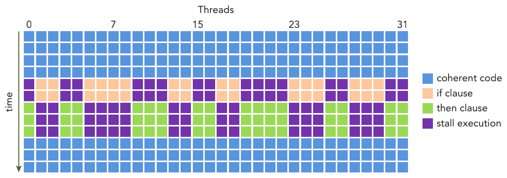

&emsp;
# Warp Divergence
# 线程束分化

&emsp;
# 1 概念
在同一线程束中的线程执行不同的指令，被称为`线程束分化`。

控制流是高级编程语言的基本构造中的一种。GPU支持传统的、C风格的、显式的控制流结构，例如，if…then…else、for和while。 

&emsp;
>CPU

CPU 拥有复杂的硬件以执行分支预测，也就是在每个条件检查中预测应用程序的控制流会使用哪个分支。

如果预测正确，CPU 中的分支只需付出很小的性能代价。

如果预测不正确，CPU 可能会停止运行很多个周期，因为指令流水线被清空了。

我们不必完全理解为什么 CPU 擅长处理复杂的控制流。这个解释只是作为对比的背景。 

&emsp;
>GPU

GPU是相对简单的设备，它没有复杂的分支预测机制。

一个线程束中的所有线程在同一周期中必须执行相同的指令，如果一个线程执行一条指令，那么线程束中的所有线程都必须执行该指令。

如果在同一线程束中的线程使用不同的路径通过同一个应用程序，这可能会产生问题。

&emsp;
# 2 例子
例如，思考下面的语句： 
```c++
if (cond) {
 ...
} else {
 ...
}
```
假设在一个线程束中有16个线程执行这段代码，cond为true，但对于其他16个来说 cond为false。一半的线程束需要执行if语句块中的指令，而另一半需要执行else语句块中的 指令。

我们已经知道，在一个线程束中所有线程在每个周期中必须执行相同的指令，所以线程束分化似乎会产生一个悖论。如果一个线程束中的线程产生分化，线程束将连续执行每一个分支路径，而禁用不执行这一路径的线程。

&emsp;
# 3 线程束分化的影响
线程束分化会导致性能明显地下降。假如有各一半的线程条件不一样，线程束中并行线程的数量减少了一半：只有16个线程同时活跃地执行，而其他16个被禁用了。

条件分支越多，并行性削弱越严重。 

注意，线程束分化只发生在同一个线程束中。在不同的线程束中，不同的条件值不会引起线程束分化。 

<div align=center>
    
    <h4>线程束分化<h>
</div>


在一个线程束中所有的线程必须采用if…then两个分支来表述。如果线程的条件为true，它将执行if子句；否则，当等待执行完成时，线程停止。 

为了获得最佳的性能，应该避免在同一线程束中有不同的执行路径。请记住，在一个线程块中，线程的线程束分配是确定的。因此，以线程块（block）的方式对数据进行分区是可行的 （尽管不是微不足道的，但取决于算法），以确保同一个线程束（warp）中的所有线程在一个应用程序中使用同一个控制路径。 

# 4 性能对比

>案例1 线程分化

假设有两个分支，下面展示了简单的算术内核示例。我们可以用一个偶数和奇数线程方法来模拟一个简单的数据分区，目的是导致线程束分化。该条件（tid%2==0）使 偶数编号的线程执行if子句，奇数编号的线程执行else子句。

```c++
__global__ void mathKernel1(float *c) {
    int tid = blockIdx.x * blockDim.x + threadIdx.x;
    float a, b;
    a = b = 0.0f;
    if (tid % 2 == 0) {
        a = 100.0f;
    } else {
        b = 200.0f;
    }
    c[tid] = a + b;
}
```
>案例2 线程不分化

如果使用线程束方法（而不是线程方法）来交叉存取数据，可以避免线程束分化，并且设备的利用率可达到100%。条件（tid/warpSize）%2==0使分支粒度是线程束大小的倍数；偶数编号的线程执行if子句，奇数编号的线程执行else子句。这个核函数产生相同的输出，但是顺序不同。

```c++
__global__ void mathKernel2(void) {
    int tid = blockIdx.x * blockDim.x + threadIdx.x;
    float a, b;
    a = b = 0.0f;
    if ((tid / warpSize) % 2 == 0) {
        a = 100.0f;
    } else {
        b = 200.0f;
    }
    c[tid] = a + b;
}
```

>完整代码

```c++
#include <cuda_runtime.h>
#include <stdio.h>
#include "common.h"

#define CHECK(call) \
{ \
    const cudaError_t error = call; \
    if (error != cudaSuccess) \
    { \
        printf("Error: %s:%d, ", __FILE__, __LINE__); \
        printf("code:%d, reason: %s\n", error, cudaGetErrorString(error)); \
        exit(1); \
    } \
}


__global__ void mathKernel1(float *c)
{
    int tid = blockIdx.x * blockDim.x + threadIdx.x;
    float ia, ib;
    ia = ib = 0.0f;

    if (tid % 2 == 0)
    {
        ia = 100.0f;
    }
    else
    {
        ib = 200.0f;
    }

    c[tid] = ia + ib;
}

__global__ void mathKernel2(float *c)
{
    int tid = blockIdx.x * blockDim.x + threadIdx.x;
    float ia, ib;
    ia = ib = 0.0f;

    if ((tid / warpSize) % 2 == 0)
    {
        ia = 100.0f;
    }
    else
    {
        ib = 200.0f;
    }

    c[tid] = ia + ib;
}

__global__ void mathKernel3(float *c)
{
    int tid = blockIdx.x * blockDim.x + threadIdx.x;
    float ia, ib;
    ia = ib = 0.0f;

    bool ipred = (tid % 2 == 0);

    if (ipred)
    {
        ia = 100.0f;
    }

    if (!ipred)
    {
        ib = 200.0f;
    }

    c[tid] = ia + ib;
}

__global__ void mathKernel4(float *c)
{
    int tid = blockIdx.x * blockDim.x + threadIdx.x;
    float ia, ib;
    ia = ib = 0.0f;

    int itid = tid >> 5;

    if (itid & 0x01 == 0)
    {
        ia = 100.0f;
    }
    else
    {
        ib = 200.0f;
    }

    c[tid] = ia + ib;
}

__global__ void warmingup(float *c)
{
    int tid = blockIdx.x * blockDim.x + threadIdx.x;
    float ia, ib;
    ia = ib = 0.0f;

    if ((tid / warpSize) % 2 == 0)
    {
        ia = 100.0f;
    }
    else
    {
        ib = 200.0f;
    }

    c[tid] = ia + ib;
}


int main(int argc, char **argv)
{
    // set up device
    int dev = 0;
    cudaDeviceProp deviceProp;
    CHECK(cudaGetDeviceProperties(&deviceProp, dev));
    printf("%s using Device %d: %s\n", argv[0], dev, deviceProp.name);

    // set up data size
    int size = 1024*10000;
    int blocksize = 64;

    if(argc > 1) blocksize = atoi(argv[1]);

    if(argc > 2) size      = atoi(argv[2]);

    printf("Data size %d ", size);

    // set up execution configuration
    dim3 block (blocksize, 1);
    dim3 grid  ((size + block.x - 1) / block.x, 1);
    printf("Execution Configure (block %d grid %d)\n", block.x, grid.x);

    // allocate gpu memory
    float *d_C;
    size_t nBytes = size * sizeof(float);
    CHECK(cudaMalloc((float**)&d_C, nBytes));

    // run a warmup kernel to remove overhead
    size_t iStart, iElaps;
    CHECK(cudaDeviceSynchronize());
    iStart = seconds();
    warmingup<<<grid, block>>>(d_C);
    CHECK(cudaDeviceSynchronize());
    iElaps = seconds() - iStart;
    printf("warmup      <<< %4d %4d >>> elapsed %.30e sec \n", grid.x, block.x,
           iElaps );
    CHECK(cudaGetLastError());

    // run kernel 1
    iStart = seconds();
    mathKernel1<<<grid, block>>>(d_C);
    CHECK(cudaDeviceSynchronize());
    iElaps = seconds() - iStart;
    printf("mathKernel1 <<< %4d %4d >>> elapsed %.30e sec \n", grid.x, block.x,
           iElaps );
    CHECK(cudaGetLastError());

    // run kernel 3
    iStart = seconds();
    mathKernel2<<<grid, block>>>(d_C);
    CHECK(cudaDeviceSynchronize());
    iElaps = seconds() - iStart;
    printf("mathKernel2 <<< %4d %4d >>> elapsed %.30e sec \n", grid.x, block.x,
           iElaps );
    CHECK(cudaGetLastError());

    // run kernel 3
    iStart = seconds();
    mathKernel3<<<grid, block>>>(d_C);
    CHECK(cudaDeviceSynchronize());
    iElaps = seconds() - iStart;
    printf("mathKernel3 <<< %4d %4d >>> elapsed %.30e sec \n", grid.x, block.x,
           iElaps);
    CHECK(cudaGetLastError());

    // run kernel 4
    iStart = seconds();
    mathKernel4<<<grid, block>>>(d_C);
    CHECK(cudaDeviceSynchronize());
    iElaps = seconds() - iStart;
    printf("mathKernel4 <<< %4d %4d >>> elapsed %.30e sec \n", grid.x, block.x,
           iElaps);
    CHECK(cudaGetLastError());

    // free gpu memory and reset divece
    CHECK(cudaFree(d_C));
    CHECK(cudaDeviceReset());
    return EXIT_SUCCESS;
}
```


