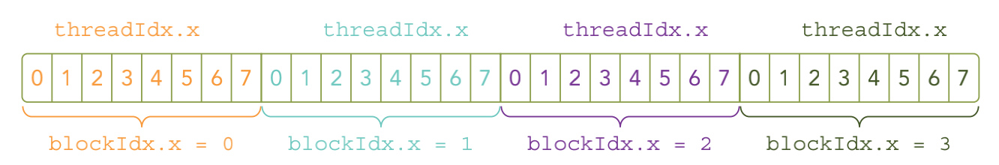

&emsp;
# Launching A CUDA Kernel
# 1 启动内核函数

>C 函数调用： 
```c++
fuction_name(argument list);
```

>CUDA C 函数调用
- CUDA 内核调用是对 C 语言函数调用语句的延伸，<<<>>> 运算符内是核函数的执行配置
```c++
kernel_name<<<gridDim, blockDim, stream>>>(argument list);
```
- `gridDim`： int 型或者 dim3 类型 (x,y,z)。 用于定义一个 grid 中的 block 是如何组织的。 int型则直接表示为1维组织结构。
- `blockDim`： int型或者dim3类型(x,y,z)。 用于定义一个 block 中的thread是如何组织的。 int型则直接表示为1维组织结构。
- `sharedMem：` size_t类型，可缺省，默认为 0。 用于设置最多能动态分配的共享内存大小，单位为 byte。 0 表示不需要动态分配。
- `stream`： cudaStream_t 类型，可缺省，默认为0。 表示该核函数位于哪个流。


&emsp;
# 2 分配 grid 和 block

同一个块（block）中的线程（thread）之间可以相互协作，不同块内的线程不能协作。对于一个给定的问题，可以使用不同的网格和块布局来组织你的线程。

例如，假设你有 32 个数据元素用于计算
- 每 8 个元素一个块，需要启动 4 个块：
```c++
kernel_name<<<4, 8>>>(argument list);
```
- 如果把所有 32 个元素放到一个块里，那么只会得到一个块： 
```c++
kernel_name<<<1, 32>>>(argument list);
```
- 如果每个块只含有一个元素，那么会有32个块： 
```c++
kernel_name<<<32, 1>>>(argument list);
```

<div align=center>
    
    <h4>每 8 个元素一个块，4 个块<h>
</div>

&emsp;

由于数据在全局内存中是线性存储的，因此可以用变量 blockIdx.x 和threadId.x 来进行以下操作
- 在网格中标识一个唯一的线程 
- 建立线程和数据元素之间的映射关系 

&emsp;
# 3 异步

核函数的调用与主机线程是异步的。核函数调用结束后，控制权立刻返回给主机端。 你可以调用以下函数来强制主机端程序等待所有的核函数执行结束：

```c++
cudaError_t cudaDeviceSynchronize(void);
```

一些 CUDA 运行时 API 在主机和设备之间是隐式同步的。当使用 cudaMemcpy 函数在主机和设备之间拷贝数据时，主机端隐式同步，即主机端程序必须等待数据拷贝完成后才能继续执行程序。 

```c++
cudaError_t cudaMemcpy(void* dst, const void* src, size_t count, cudaMemcpyKind kind);
```

之前所有的核函数调用完成后开始拷贝数据。当拷贝完成后，控制权立刻返回给主机端。


