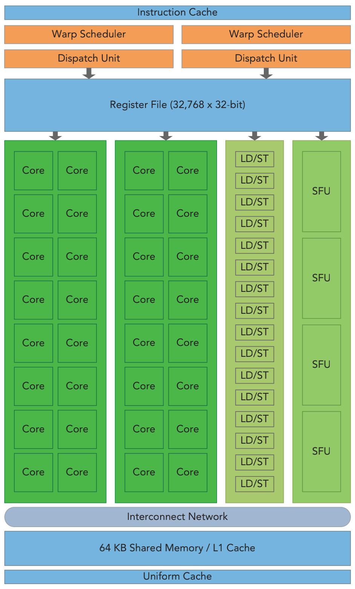
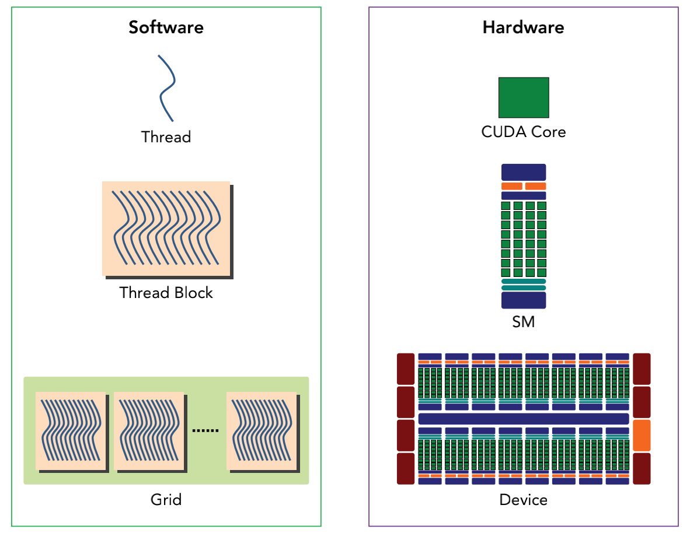
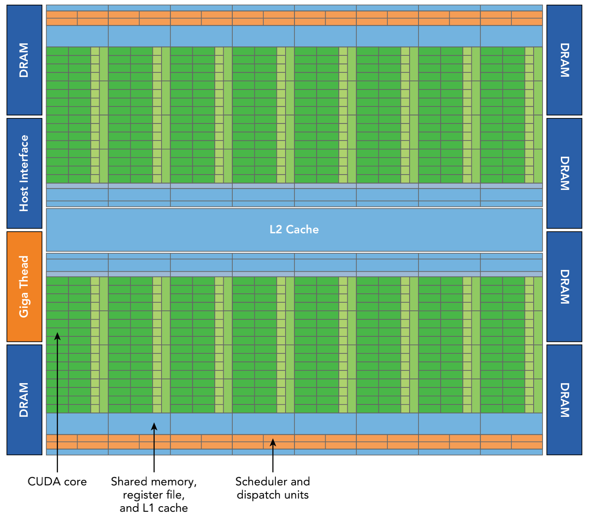
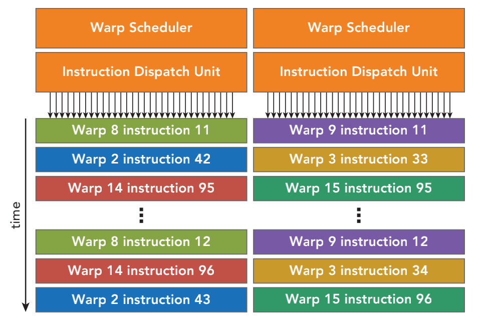
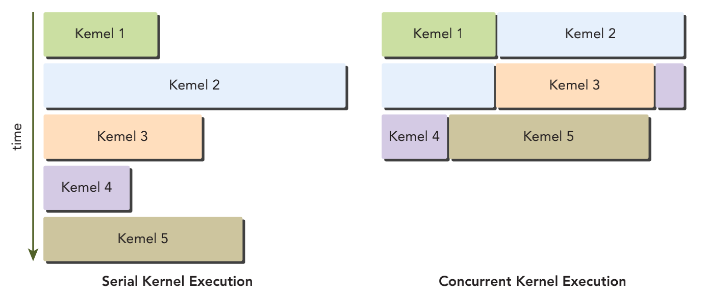
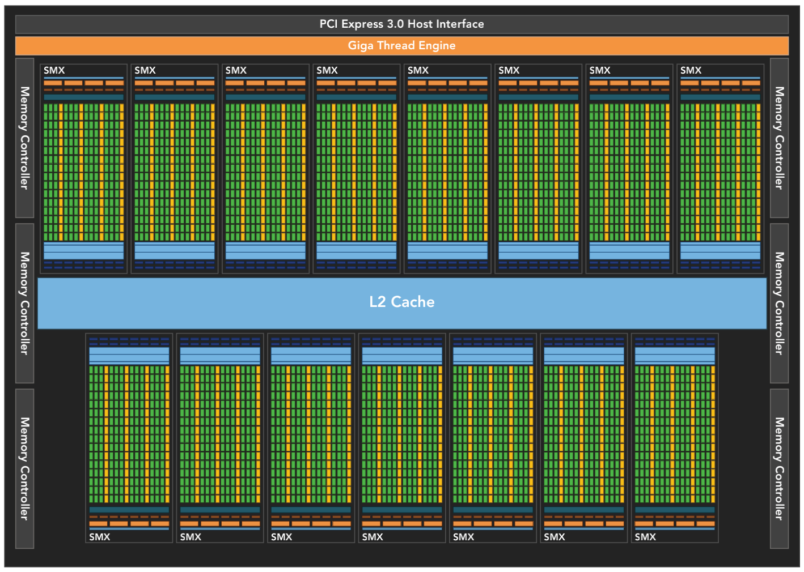
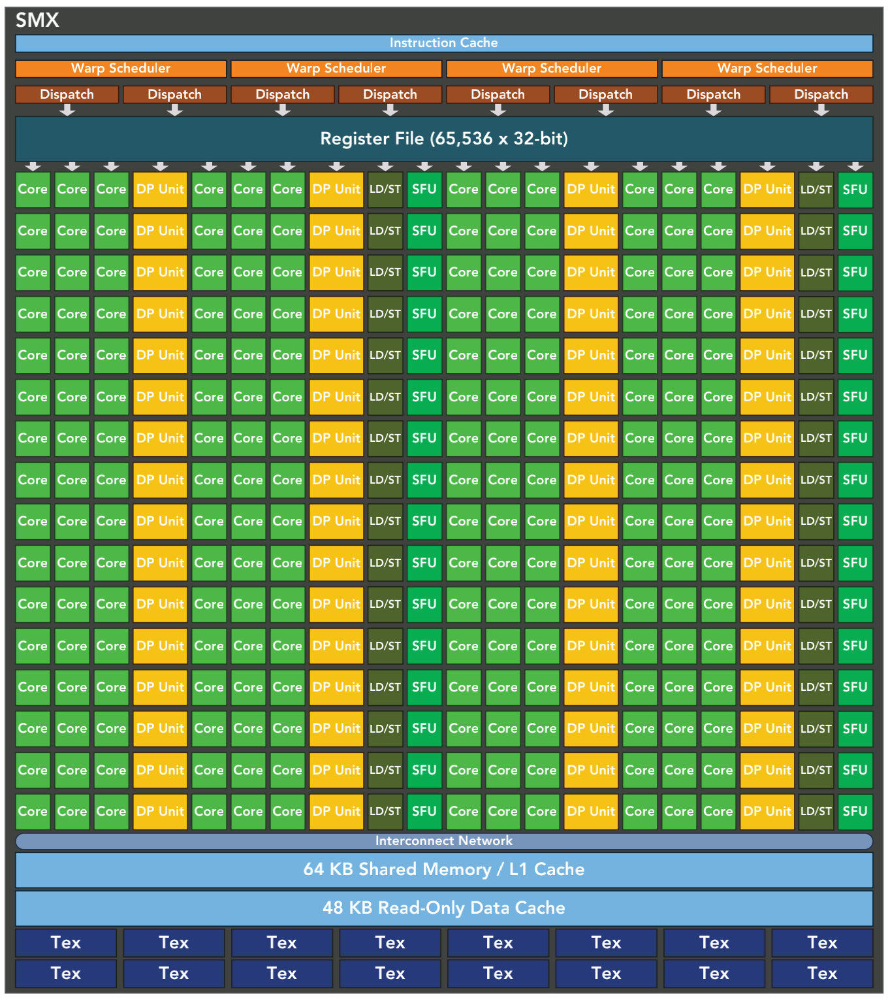
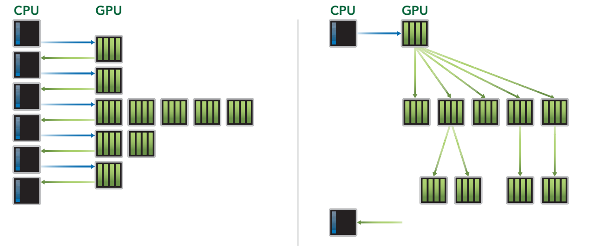
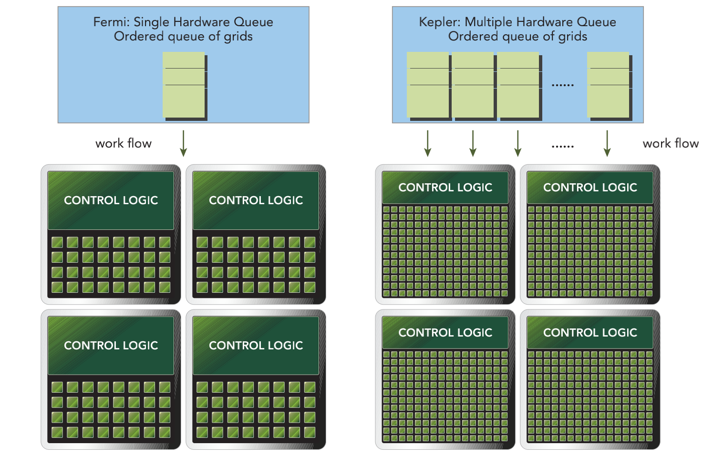
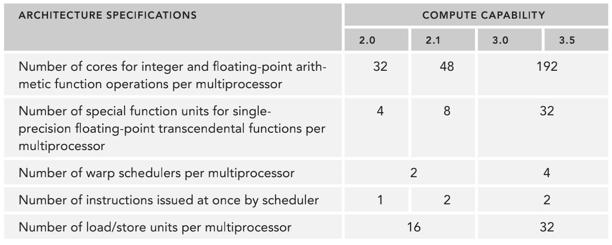

&emsp;
# GPU Architecture

一般来说，执行模型会提供一个操作视图，说明如何在特定的计算架构上执行指令。 

CUDA 执行模型揭示了 GPU 并行架构的抽象视图，使我们能够据此分析线程的并发。

前面已经介绍了 CUDA 编程模型中两个主要的抽象概念：
- 内存层次结构
- 线程层次结构

它们能够控制大规模并行GPU。因此，CUDA 执行模型能够提供有助于在`指令吞吐量`和`内存访问`方面编写高效代码的参考。

    

&emsp;
# 1 GPU 架构概述

## 1.1 SM，Stream Multiprocessor
GPU 架构是围绕一个`流式多处理器（SM，Stream Multiprocessor）`的可扩展阵列搭建的。可以通过复制这种架构的构建块来实现 GPU 的硬件并行。  

SM 是 GPU 架构的核心。寄存器和共享内存是 SM 中的稀缺资源。CUDA 将这些资源分配到 SM 中的所有常驻线程里。因此，这些有限的资源限制了在 SM 上活跃的线程束数量， 活跃的线程束数量对应于SM上的并行量。了解一些SM硬件组成的基本知识，有助于组织线程和配置内核执行以获得最佳的性能。

GPU 中的每一个 SM 都能支持数百个线程并发执行，每个 GPU 通常有多个 SM，所以在一个 GPU 上并发执行数千个线程是有可能的。

当启动一个内核网格时，它的`线程块（block）`被分布在了可用的 SM 上来执行。线程块一旦被调度到一个 SM 上，其中的`线程（thread）`只会在那个指定的 SM 上并发执行。

多个线程块（block）可能会被分配到同一个 SM 上，而且是根据 SM 资源的可用性进行调度的。同一线程中的指令利用指令级并行性进行流水线化，另外，在CUDA中已经介绍了线程级并行。 

&emsp;
## 1.2 SIMT 与 SIMD

CUDA采用单指令多线程（SIMT）架构来管理和执行线程，每 32 个线程为一组，被称为`线程束（warp）`。线程束中的所有线程同时执行`相同的指令`。每个线程都有自己的指令地址计数器和寄存器状态，利用自身的数据执行当前的指令。每个 SM 都将分配给它的`线程块（block）`划分到包含 32 个`线程（thread）`的`线程束（warp）`中，然后在可用的硬件资源上调度执行。

SIMT 架构与 SIMD（单指令多数据）架构相似。两者都是将`相同的指令`广播给多个执行单元来实现并行。一个关键的区别是 SIMD 要求同一个向量中的所有元素要在一个统一的同步组中一起执行，而SIMT允许属于同一线程束的多个线程独立执行。

尽管一个线程束（warp）中的所有线程（thread）在相同的程序地址上同时开始执行，但是单独的线程仍有可能有不同的行为。

SIMT 确保可以编写独立的线程级并行代码、标量线程以及用于协调线程的数据并行代码。

SIMT 模型包含3个 SIMD 所不具备的关键特征
- 每个线程都有自己的指令地址计数器 
- 每个线程都有自己的寄存器状态 
- 每个线程可以有一个独立的执行路径 

>Tips: 一个神奇的数字：32 
- 32 在 CUDA 程序里是一个神奇的数字。它来自于硬件系统，也对软件的性能有着重要的影响。从概念上讲，它是 SM 用 SIMD 方式所同时处理的工作粒度。优化工作负载以适应线程 束（一组有32个线程）的边界，一般这样会更有效地利用GPU计算资源。在后面的章节中 将会介绍更多这方面的内容。

&emsp;
## 1.3 block 在 SM 的调度

一个线程块（block）只能在一个 SM 上被调度。一旦线程块（block）在一个 SM 上被调度，就会保存在该 SM 上直到执行完成。

在同一时间，一个 SM 可以容纳多个线程块（block）。 

图3-2从逻辑视图和硬件视图的角度描述了 CUDA 编程对应的组件。 

在 SM 中，`共享内存`和`寄存器`是非常重要的资源。共享内存被分配在 SM 上的常驻线程块中，寄存器在线程中被分配。线程块中的线程通过这些资源可以进行相互的合作和通信。尽管线程块里的所有线程都可以逻辑地并行运行，但是并不是所有线程都可以同时在 物理层面执行。因此，线程块（block）里的`不同线程可能会以不同的速度前进`。

    
    <h4>CUDA 编程对应的组件的逻辑视图和硬件视图<h>

&emsp;
# 2 Fermi 架构

## 2.1 Fermi 架构
Fermi 架构是第一个完整的 GPU 计算架构，能够为大多数高性能计算应用提供所需要的功能。Fermi 已经被广泛应用于加速生产工作负载中，其重点是 GPU 计算，它在很大程度上忽略了图形具体组成部分。

Fermi的特征是多达 512 个加速器核心，这被称为 `CUDA core`。每个CUDA core 都有一个全流水线的`整数算术逻辑单元（ALU）`和一个`浮点运算单元（FPU）`，在这里每个时钟周期执行一个整数或是浮点数指令。

CUDA 核心被组织到 16 个 SM 中，每一个 SM 含有 32 个 CUDA 核心。Fermi架构有6个384位的 `GDDR5 DRAM 存储器`接口，支持多达 6GB 的全局机载内存，这是许多应用程序关键的计算资源。主机接口通过PCIe总线将 GPU 与CPU相连。`GigaThread引擎`是一个全局调度器，用来分配线程块到 SM 线程束调度器上。

    
    <h4>Fermi 架构<h>

&emsp;
>Fermi 架构一个 SM，包含了以下内容： 

- 执行单元（CUDA核心），CUDA core 16x32 个  
- 调度线程束的调度器和调度单元，Scheduler dispatch units
- 共享内存、寄存器文件和一级缓存，shared memory/register/L1 cache
- 加载/存储单元，LD/ST units，16个，允许每个时钟周期内有16个 线程（线程束的一半）计算源地址和目的地址
- 特殊功能单元，SFU，执行固有指令，如正弦、余弦、平方根和插值。每个SFU在每个时钟周期内的每个线程上执行一个固有指令
- 线程束调度器和指令调度单元，scheduler/dispatch unists，
- 二级缓存（L2 cache），768 KB

&emsp;
## 2.2 硬件资源分配过程

&emsp;
>硬件资源分配过程

    
    <h4>Fermi 架构<h>

- 当一个线程块（block）被指定给一个 SM 时
    - 线程块（block）中的所有线程（thread）被分成了线程束（warp）
    - 两个线程束调度器（scheduler）选择两个线程束（warp）
    - 再把一个指令用指令调度单元（dispatch units）从线程束（warp）中发送到一个组上
    - 组里有16个CUDA core、16个加载/存储单元（LD/ST units）或4个特殊功能单元（SFU）
    - Fermi架构，计算性能2.x，可以在每个 SM 上同时处理 48个 线程束（warp），即可在一个 SM 上同时常驻1536个线程。

&emsp;

>片内可配置存储器

Fermi 架构的一个关键特征是有一个64KB的`片内可配置存储器`，它在共享内存（shared memory）与一级缓存（L1 cache）之间进行分配。

>共享内存

对于许多高性能的应用程序，共享内存是影响性能的一个关键因素。共享内存允许一个块上的线程相互合作，这有利于芯片内数据的广泛重用，并大大降低了片外的通信量。

CUDA提供了一个运行时API，它可以用来调整共享内存和一级缓存的数量。根据给定的内核中共享内存或缓存的使用修改片内存储器的配置，可以提高性能。

&emsp;
## 2.3 并发内核执行

Fermi 架构也支持并发内核执行：在相同的 GPU 上执行相同应用程序的`上下文（context）`中，同时启动多个内核。并发内核执行允许执行一些小的内核程序来充分利用 GPU

Fermi 架构允许多达16个内核同时在设备上运行。从程序员的角度看，并发内核执行使GPU表现得更像 MIMD 架构。

    
    <h4>Fermi 架构<h>

&emsp;
# 3 Kepler 架构

## 3.1 Kepler 架构
发布于2012年秋季的 Kepler GPU 架构是一种快速、高效、高性能的计算架构。它包含了15个 SM 和 6 个 64 位的内存控制器。

>Kepler架构的3个重要的创新
- 强化的 SM 
- 动态并行 
- 件驱动优化

    
    <h4>Kepler K20X芯片框图<h>

&emsp;

## 3.2 强化的SMX
Kepler K20X的关键部分是有一个新的 SM 单元，其包括一些结构的创新，以提高编程效率和功率效率。

每个 Kepler SM 单元包含
- 192个单精度CUDA core
- 64个双精度单元（DP Unit）
- 32 个特殊功能单元（SFU）
- 32个加载/存储单元（LD/ST）
- 4个线程束调度器（Warp Scheduler）
- 8个指令调度器（Dispatch）

    
    <h4>SMX<h>

&emsp;

>Warp Scheduler和Dispatch

每个Kepler SM包括4个线程束调度器（Warp Scheduler）和8个指令调度器（Dispatch），以确保在单一的 SM 上同时发送和执行4个线程束。Kepler K20X架构（计算能力3.5）可以同时在每个SM上调度64个线程束，即在一个SM上可同时常驻2048个线程。
>Register File

K20X架构中寄存器文件容量达到 64KB， Fermi架构中只有 32KB。同时，K20X 还允许片内存储器在共享内存和一级缓存间有更多的分区。K20X 能够提供超过 1TFlop 的峰值双精度计算能力，相较于Fermi的设计，功率效率提高了80%，每瓦的性能也提升了三倍。 

&emsp;
## 3.3 动态并行
动态并行是 Kepler GPU 的一个新特性，它允许 GPU 动态启动新的网格。有了这个特 点，任一内核都能启动其他的内核，并且管理任何核间需要的依赖关系来正确地执行附加 的工作。这一特点也让你更容易创建和优化递归及与数据相关的执行模式。

    
    <h4>SMX<h>

&emsp;

如图上图所示，它展示了没有动态并行时主机在 GPU 上启动每一个内核时的情况和有了动态并行运行的情况

有了动态并行，GPU能够启动嵌套内核，消除了与 CPU 通信的需求。

动态并行拓宽了 GPU 在各种学科上的适用性。动态地启动小型和中型的并行工作负载，这在以前是需要很高代价的。

&emsp;
## 3.4 Hyper-Q

Hyper-Q 技术增加了更多的 CPU 和 GPU 之间的同步硬件连接，以确保 CPU 核心能够在 GPU 上同时运行更多的任务。因此，当使用Kepler GPU时，既可以增加 GPU 的利用率，也可以减少 CPU 的闲置时间。

Fermi GPU 依赖一个单一的硬件工作队列来从 CPU 到 GPU 间传送任务，这可能会导致一个单独的任务阻塞队列中在该任务之后的所有其他任务。Kepler Hyper-Q消除了这个限制。

    
    <h4>SMX<h>

&emsp;

如上图所示，Kepler GPU 在主机与 GPU 之间提供了32个硬件工作队列。Hyper-Q 保证了在 GPU 上有更多的并发执行，最大限度地提高了 GPU 的利用并提高了整体的性能。

    
    <h4>主要架构的不同计算能力<h>

&emsp;

# 4 性能分析和优化（Profile-Driven Optimization）

性能分析是通过检测来分析程序性能的行为： 
- 应用程序代码的空间（内存）或时间复杂度 
- 特殊指令的使用 
- 函数调用的频率和持续时间 

性能分析是程序开发中的关键一步，特别是对于优化HPC应用程序代码。性能分析往往需要对平台的执行模型有一个基本的理解以制定应用程序的优化方法。

开发一个HPC应用程序通常包括两个主要步骤： 
1. 提高代码的正确性
2. 提高代码的性能

对于第二步，使用配置文件驱动的方法是很自然的。配置文件驱动的发展对于 CUDA 编程尤为重要，原因主要有以下几个方面
- 一个单纯的内核应用一般不会产生最佳的性能。性能分析工具能帮助你找到代码中 影响性能的关键部分，也就是性能瓶颈
- CUDA 将 SM 中的计算资源在该 SM 中的多个常驻线程块之间进行分配。这种分配形式导致一些资源成为了性能限制者。性能分析工具能帮助我们理解计算资源是如何被利用的
- CUDA 提供了一个硬件架构的抽象，它能够让用户控制线程并发。性能分析工具可以检测和优化，并将优化可视化

性能分析工具深入洞察内核的性能，检测核函数中影响性能的瓶颈。CUDA提供了两 个主要的性能分析工具：
- nvvp，独立的可视化分析器；
- nvprof，命令行分析器

>nvvp
- nvvp是可视化分析器，它可以可视化并优化CUDA程序的性能。这个工具会显示 CPU 与GPU 上的程序活动的时间表，从而找到可以改善性能的机会。

- 此外，nvvp可以分析应用 程序潜在的性能瓶颈，并给出建议以消除或减少这些瓶颈。该工具既可作为一个独立的应 用程序，也可作为Nsight Eclipse Edition（nsight）的一部分。 

>nvprof

nvprof在命令行上收集和显示分析数据。nvprof是和CUDA 5一起发布的，它是从一个 旧的命令行CUDA分析工具进化而来的。跟nvvp一样，它可以获得CPU与GPU上CUDA关联活动的时间表，其中包括内核执行、内存传输和CUDA的API调用。

它也可以获得硬件计数器和CUDA内核的性能指标。 

除了预定义的指标，还可以利用基于分析器获得的硬件计数器来自定义指标。 

>事件和指标 

在CUDA性能分析中
- 事件是可计算的活动，它对应一个在内核执行期间被收集的`硬件计数器`
- 指标是内核的特征，它由一个或多个事件计算得到。

注意
- 大多数计数器通过流式多处理器（SM）来报告，而不是通过整个 GPU
- 一个单一的运行只能获得几个计数器。有些计数器的获得是相互排斥的。多个性能 分析运行往往需要获取所有相关的计数器
- 由于GPU执行中的变化（如线程块和线程束调度指令），经重复运行，计数器值可能不是完全相同的。 

有3种常见的限制内核性能的因素： 
- 存储带宽 
- 计算资源 
- 指令和内存延迟 

