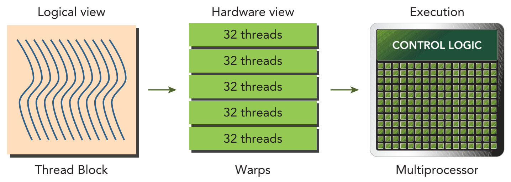
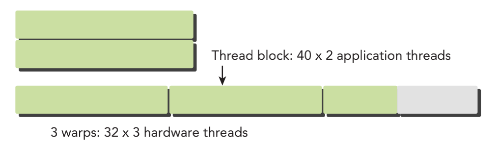

&emsp;
# Warps And Thread Blocks
# 线程束和线程块

`线程束（warp）`是 SM 中基本的执行单元。当一个线程块（block）的网格（grid）被启动后
- 网格（grid）中的线程块（block）分布在 SM 中
- 一旦线程块（block）被调度到一个 SM 上
- 线程块（block）中的线程（thread）会被进一步划分为线程束（warp） 

一个线程束（warp）由32个连续的线程组成，在一个线程束中，所有的线程按照单指令多线程 （SIMT）方式执行；也就是说，所有线程都执行`相同的指令`，每个线程在私有数据上进行操作。
<div align=center>
    
    <h4>线程块的逻辑视图和硬件视图<h>
</div>

&emsp;


从硬件的角度来看，所有的线程（thread）都被组织成了一维的，线程块（block）可以被配置为一维、二维或三维的。在一个块（block）中，每个线程（thread）都有一个唯一的ID。

对于一维的线程块，唯一的线程 ID 被存储在 CUDA 的内置变量 threadIdx.x 中，并且，threadIdx.x 中拥有连续值的线程（thread）被分组到线程束（warp）中。例如，一个有128个线程的一维线程块被组织到4个线程束（warp）里，如下所示：
```c++
Warp 0: thread 0, thread 1, thread 2, ... thread 31
Warp 1: thread 32, thread 33, thread 34, ... thread 63
Warp 3: thread 64, thread 65, thread 66, ... thread 95
Warp 4: thread 96, thread 97, thread 98, ... thread 127
```

&emsp;


二维或三维线程块的逻辑布局可以转化为一维物理布局。

二维线程块，每个线程的独特标识符： 
```c++
threadIdx.y * blockDim.x + threadIdx.x.
```

三维线程块，每个线程的独特标识符： 
```c++
threadIdx.z * blockDim.y * blockDim.x + threadIdx.y * blockDim.x + threadIdx.x
```

一个线程块的线程束（warp）的数量可以根据下式确定： 
$$WarpsPerBlock = ceil(\frac{ThreadsPerBlock}{warpSize})$$


因此，硬件总是给一个线程块（block）分配一定数量的线程束（warp）。线程束（warp）不会在不同的线程块（block）之间分离。

如果线程块（block）的大小不是线程束（warp）大小的偶数倍，那么在最后的线程束（warp）里有些线程就不会活跃。

&emsp;
<div align=center>
    
</div>

&emsp;


上图是一个(2, 40)的二维线程块（block）。从应用程序的角度来看，在一个二维网格中共有 80 个线程（thread）。 硬件为这个线程块配置了 3 个线程束（warp），使总共96个硬件线程去支持80个软件线程。

注意，最后半个线程束（warp）是不活跃的。即使这些线程（thread）未被使用，它们仍然消耗 SM 的资源，如寄存器。

>Tips:线程块：逻辑角度与硬件角度
- 从逻辑角度来看，线程块是线程的集合，它们可以被组织为`一维、二维或三维`布局。 
- 从硬件角度来看，线程块是`一维线程束`的集合。在线程块中线程被组织成一维布局， 每32个连续线程组成一个线程束。

